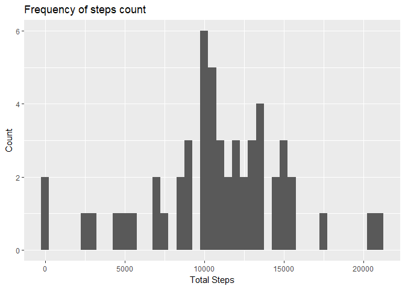
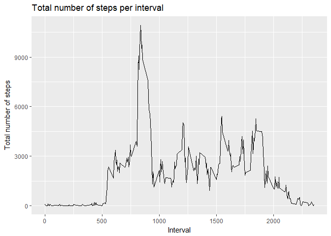
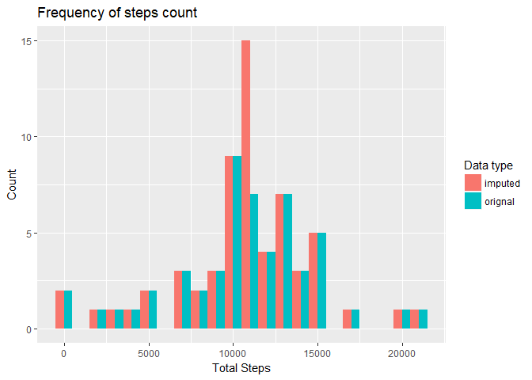
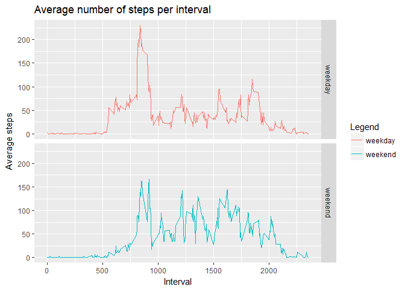

In this document we will try to answer questions related to data gathered from activity monitoring devices.

## Setup

In the interest of reproduciblity, please find below information on the environment the analysis was run on:

```r
sessionInfo()
```

```
## R version 3.5.0 (2018-04-23)
## Platform: i386-w64-mingw32/i386 (32-bit)
## Running under: Windows 10 x64 (build 17134)
## 
## Matrix products: default
## 
## locale:
## [1] LC_COLLATE=English_Singapore.1252  LC_CTYPE=English_Singapore.1252   
## [3] LC_MONETARY=English_Singapore.1252 LC_NUMERIC=C                      
## [5] LC_TIME=English_Singapore.1252    
## 
## attached base packages:
## [1] stats     graphics  grDevices utils     datasets  methods   base     
## 
## loaded via a namespace (and not attached):
##  [1] compiler_3.5.0  backports_1.1.2 magrittr_1.5    rprojroot_1.3-2
##  [5] tools_3.5.0     htmltools_0.3.6 yaml_2.1.19     Rcpp_0.12.17   
##  [9] stringi_1.1.7   rmarkdown_1.10  knitr_1.20      stringr_1.3.1  
## [13] digest_0.6.15   evaluate_0.11
```

## Loading and preprocessing the data

The data was downloaded from <https://d396qusza40orc.cloudfront.net/repdata%2Fdata%2Factivity.zip>. This is a `zip` archive containing a single CSV file.


```r
# set this to your working directory
#setwd("C:/shared/datasciencecoursera/repdata")

downloadAndExtractData <- function() {
  if (!file.exists("activity.csv")) {
    dataUrl <- "https://d396qusza40orc.cloudfront.net/repdata%2Fdata%2Factivity.zip"
    filename <- "repdata_activity.zip"
    download.file(dataUrl, filename)
    unzip(filename)
  } else {
    print("Found activity.csv in the working directy, will not download again")
  }
}

downloadAndExtractData()
```

We read the CSV using `read.csv` and convert the `date` column to actual Date objects instead of factors. This is not mandatory now but we'll need this later to differentiate weekdays vs weekends:


```r
data <- read.csv("activity.csv")
str(data)
```

```
## 'data.frame':	17568 obs. of  3 variables:
##  $ steps   : int  NA NA NA NA NA NA NA NA NA NA ...
##  $ date    : Factor w/ 61 levels "2012-10-01","2012-10-02",..: 1 1 1 1 1 1 1 1 1 1 ...
##  $ interval: int  0 5 10 15 20 25 30 35 40 45 ...
```

```r
library(lubridate)
```

```
## 
## Attaching package: 'lubridate'
```

```
## The following object is masked from 'package:base':
## 
##     date
```

```r
data$date <- ymd(as.character(data$date))
str(data)
```

```
## 'data.frame':	17568 obs. of  3 variables:
##  $ steps   : int  NA NA NA NA NA NA NA NA NA NA ...
##  $ date    : Date, format: "2012-10-01" "2012-10-01" ...
##  $ interval: int  0 5 10 15 20 25 30 35 40 45 ...
```

Note that the interval columns contains integer data representing a 'HHmm' format (so for instance 835 represents 8 hours and 35 minutes).

## What is mean total number of steps taken per day?

We first start by filtering out NA values (incomplete observations).

```r
library(dplyr)
```

```
## 
## Attaching package: 'dplyr'
```

```
## The following objects are masked from 'package:lubridate':
## 
##     intersect, setdiff, union
```

```
## The following objects are masked from 'package:stats':
## 
##     filter, lag
```

```
## The following objects are masked from 'package:base':
## 
##     intersect, setdiff, setequal, union
```

```r
library(ggplot2)
steps_by_day <- data %>% 
                      filter(!is.na(steps)) %>% 
                      group_by(date) %>% 
                      summarise(total=sum(steps))
p <- ggplot(steps_by_day, aes(x=total)) + 
      geom_histogram(binwidth=500) + 
      labs(x='Total Steps',y='Count', title='Frequency of steps count')
print(p)
```

<!-- -->

We see that most of the subjecs from this dataset achieved 10k steps a day.

The median and mean steps taken per day are:


```r
s <- summary(steps_by_day$total, na.rm=TRUE)
print(s["Median"])
```

```
## Median 
##  10765
```

```r
print(s["Mean"])
```

```
##     Mean 
## 10766.19
```

## What is the average daily activity pattern?

To answer this we plot a time series of 


```r
total_steps_by_interval <- data %>%
                            filter(!is.na(steps)) %>%
                            group_by(interval) %>%
                            summarise(total=sum(steps))
p <- ggplot(total_steps_by_interval, aes(x=interval,y=total)) + 
      geom_line() +
      labs(x="Interval",y="Total number of steps",title="Total number of steps per interval")
print(p)
```

<!-- -->

The most active interval can be found by:


```r
filter(total_steps_by_interval, total==max(total))
```

```
## # A tibble: 1 x 2
##   interval total
##      <int> <int>
## 1      835 10927
```

Which is 8:35.

## Imputing missing values

The data contains a number of missing observations.


```r
total_rows_with_NA <- sum(is.na(data$steps))
print(total_rows_with_NA)
```

```
## [1] 2304
```

Which is a non-trivial proportion of the over data - namely 13%.


```r
total_rows_with_NA/nrow(data)
```

```
## [1] 0.1311475
```

Given a missing number of steps for an interval, we replace it by finding the median for that interval across all days and validate all missing values have been replaced:


```r
data_filled <- data %>%
                group_by(interval) %>%
                mutate(steps=replace(steps, is.na(steps), mean(steps, na.rm=TRUE)))

total_rows_with_NA_after_fill <- sum(is.na(data_filled$steps))
print(total_rows_with_NA)
```

```
## [1] 2304
```

```r
print(total_rows_with_NA_after_fill)
```

```
## [1] 0
```

The new median and mean for this dataset is:


```r
steps_by_day_filled <- data_filled %>% 
    group_by(date) %>% 
    summarise(total=sum(steps))
  
ss <- summary(steps_by_day_filled$total, na.rm=TRUE)
print(ss["Median"])
```

```
##   Median 
## 10766.19
```

```r
print(ss["Mean"])
```

```
##     Mean 
## 10766.19
```

So compared to the original dataset, the mean is identical and the median has moved slightly. But what about the overall distribution? Let's plot a histogram of both side by side.


```r
library(tidyr)
# we join both datasets by date - but the one with missing data will have missing dates
x <- right_join(steps_by_day, steps_by_day_filled, by=c('date'))
names(x) <- c("date","orignal","imputed")
g <- gather(x, type, total, c(2,3))
g_without_NA <- g %>% filter(!is.na(total))
p <- ggplot(g_without_NA, aes(total, fill=type)) + 
      geom_histogram(position="dodge", binwidth=1000) + 
      labs(x='Total Steps',y='Count', title='Frequency of steps count', fill='Data type')
print(p)
```

<!-- -->

The biggest difference is the number of days filled with around 10.5k steps. This makes sense given the median number of steps is 10,766.

## Are there differences in activity patterns between weekdays and weekends?

The final question is to see whether activity paterns differ on weekdays versus weekends.


```r
data_toggle <- data_filled %>% 
                mutate(isWeekend=ifelse(weekdays(date) %in% c('Saturday','Sunday'), "weekend", "weekday"))

data_toggle$isWeekend <- as.factor(data_toggle$isWeekend)
d <- data_toggle %>%
      group_by(isWeekend,interval) %>%
      summarise(avg=mean(steps))
p <- ggplot(d, aes(x=interval,y=avg,color=isWeekend)) + 
      geom_line() + 
      facet_grid(isWeekend~.) +
      labs(x='Interval',y='Average steps',title='Average number of steps per interval',color='Legend')
print(p)
```

<!-- -->

If anything we see the activity pattern is roughly the same but the subjects were a bit more active during the middle of the day on weekends and also started activities a little later as opposed to weekdays.
